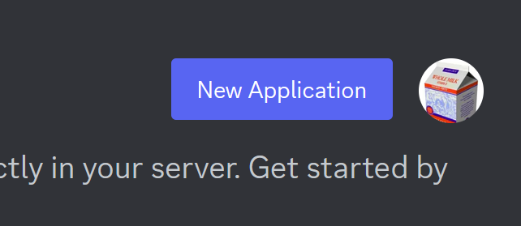
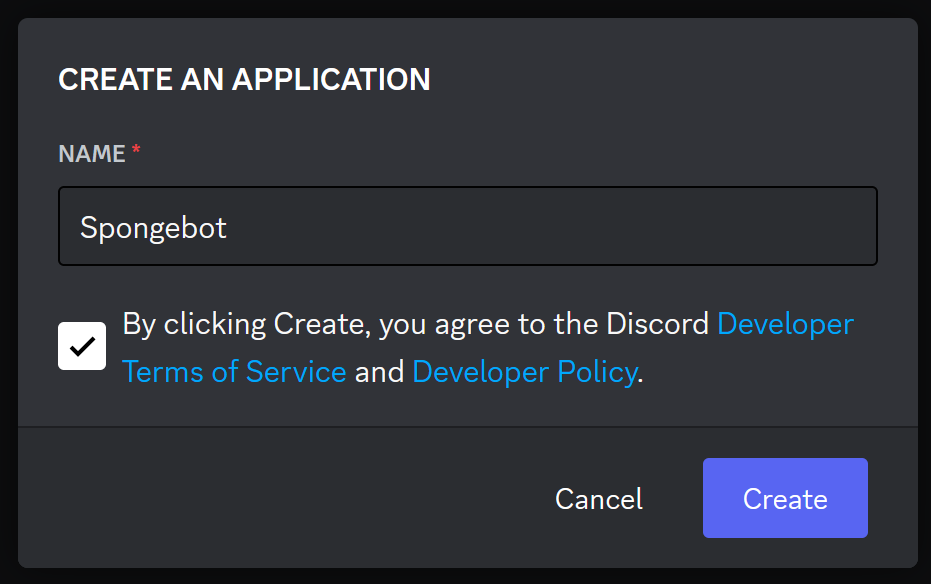
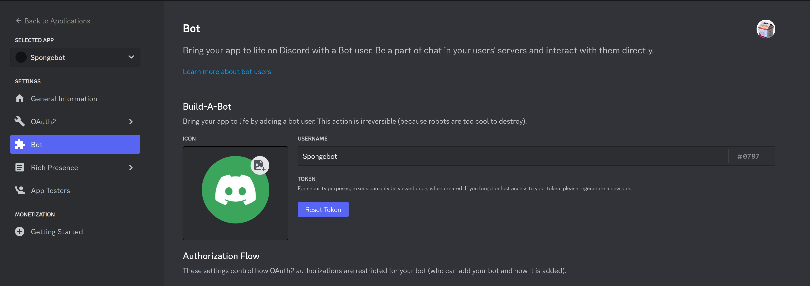

# Week 1
Welcome to week 1, we are going to start by setting up out project.

Requirements:
- NodeJS
- Code Editor
- Discord Account

Optional:
- Git

## Installing NodeJS
You can install the latest LTS (Long Term Support) v18 from the NodeJS website.
https://nodejs.org/

This will download an installer. Follow the prompts as you see them. If you have any applications open such as your text editor or terminal, you may need to restart them for the command line utilities to be available.

(If you have any problems with the commands on the next step, ask for help. It is possible your PATH has been misconfigured)

## Finding a text editor
Below are a list of recommended code editors to use. It doesn't matter which you pick, just that you pick one that is comfortable for you. VS Code is a very good choice since it has a rich plugin ecosystem and easy git integration and can be used for various other purposes.

- VS Code (Recommended)
- Notepad++
- (Paid) Sublime Text
- (Paid) WebStorm

## Installing Git
Git can be installed from https://git-scm.com/downloads

# Starting the project
We are going to start by initializing our project. When you installed NodeJS, npm was also installed. npm is a package manager for Node. There are alternatives but npm is the most common so we will stick with that for now.

We can initialize our project by running the following command
```shell
npm init -y
```

Now we will initialize our Git repository so we can keep track of our changes over time.
```shell
git init
```

Now we are going to use a library to interface with discord. This is not an official library by Discord. There are many other libraries for other languages and environments. Since we are using NodeJS we will use the discord.js library
```shell
npm install discord.js
```

And now we should have the basic scaffolding for our NodeJS app!

## Creating the Bot
Before we move any further, there is something else must do. In order to have a bot we can use in Discord, we first must register our bot. This will give us the neccessary credentials for our next steps.

Visit the [Discord Developer Portal](https://discord.com/developers) and sign in with your Discord account. You will be greeted with a dashboard for your "Applications." Let's create a new one. In the top right corner click the "New Application" button.



Give it a friendly name and agree to the terms and policies.



And on the sidebar, visit the "Bot" tab. Click "Reset Token" and make sure you keep that code safe and don't share it with anyone.



Now we're ready to get down to business.

# Coding the Bot

```js
const { Client, Events, GatewayIntentBits } = require('discord.js');
const token = 'MTE2MzYwMDIwODg5NTE1MjI0OQ.GLcluh.-zICHlylYKykjGGV4AniNxJsUbel_WmTLQxkjA';

const client = new Client({ intents: [
        GatewayIntentBits.Guilds,
        GatewayIntentBits.GuildMessages,
        GatewayIntentBits.MessageContent,
    ] });

client.once(Events.ClientReady, client => {
    console.log(`Bot online! ${client.user.tag}`);
});

client.on(Events.MessageCreate, (message) => {
    if (message.author.bot) return;

    if (message.content.toLowerCase() === 'hi') {
        message.channel.send('Hi, ${message.author.username}');
    }
});

client.login(token);
```

It's alive!!!